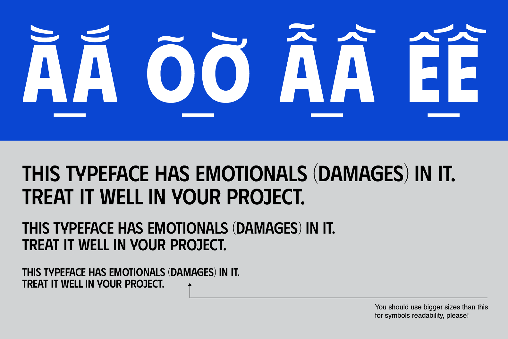

# DT Phudu Project

[![][Fontbakery]](https://duongtrtype.github.io/DTPhudu/fontbakery/fontbakery-report.html)
[![][Universal]](https://duongtrtype.github.io/DTPhudu/fontbakery/fontbakery-report.html)
[![][GF Profile]](https://duongtrtype.github.io/DTPhudu/fontbakery/fontbakery-report.html)
[![][Outline Correctness]](https://duongtrtype.github.io/DTPhudu/fontbakery/fontbakery-report.html)
[![][Shaping]](https://duongtrtype.github.io/DTPhudu/fontbakery/fontbakery-report.html)

[Fontbakery]: https://img.shields.io/endpoint?url=https%3A%2F%2Fraw.githubusercontent.com%2Fduongtrtype%2FDTPhudu%2Fgh-pages%2Fbadges%2Foverall.json
[GF Profile]: https://img.shields.io/endpoint?url=https%3A%2F%2Fraw.githubusercontent.com%2Fduongtrtype%2FDTPhudu%2Fgh-pages%2Fbadges%2FGoogleFonts.json
[Outline Correctness]: https://img.shields.io/endpoint?url=https%3A%2F%2Fraw.githubusercontent.com%2Fduongtrtype%2FDTPhudu%2Fgh-pages%2Fbadges%2FOutlineCorrectnessChecks.json
[Shaping]: https://img.shields.io/endpoint?url=https%3A%2F%2Fraw.githubusercontent.com%2Fduongtrtype%2FDTPhudu%2Fgh-pages%2Fbadges%2FShapingChecks.json
[Universal]: https://img.shields.io/endpoint?url=https%3A%2F%2Fraw.githubusercontent.com%2Fduongtrtype%2FDTPhudu%2Fgh-pages%2Fbadges%2FUniversal.json

DT Phudu is a display sans-serif typeface inspired by Vietnamese hand-lettering billboards in the old days. It consists of 5 weights from Light to Black, and the lighter it gets, the extended it becomes, for readability compared to other lightweight narrow typefaces. Some details are cutting-edge and not sharpened for this purpose too. DT Phudu has the same upper and lower-case, with the message of using only ALLCAPS for display purposes just like our Vietnamese billboard styles.

Why I made this typeface? In the process of learning and crafting types, I have always thought about what makes a Vietnamese typeface. If we rewind to the past, we can see our lettering styles on the billboard stores, when the artists adapted Latin typefaces and then added marks based on their styles. Among those, there were mostly all-caps sans-serif types played as descriptions or sometimes the store's names themself. To make a new easy to read and easy-to-get typeface, I mixed some of the research from the story above with letters. I don't want to just revive the types, I want to improve them, so they can fit the modern-day styles but still have "Vietnamese" souls in them. The typeface was named DT Phudu (phục dựng) - "revival" in Vietnamese, and has a meaning of timeless (quite the opposite of the name when it can be read as "phù du" - ephemeral).

## About

Duong Tran is a young type designer in Vietnam, who is still wandering and turning what he sees into new ideas.

## Building

Fonts are built automatically by GitHub Actions - take a look in the "Actions" tab for the latest build.

If you want to build fonts manually on your own computer:

* `make build` will produce font files.
* `make test` will run [FontBakery](https://github.com/googlefonts/fontbakery)'s quality assurance tests.
* `make proof` will generate HTML proof files.

The proof files and QA tests are also available automatically via GitHub Actions - look at https://duongtrtype.github.io/DTPhudu.

## Changelog

When you update your font (new version or new release), please report all notable changes here, with a date.
[Font Versioning](https://github.com/googlefonts/gf-docs/tree/main/Spec#font-versioning) is based on semver. 
Changelog example:

**26 May 2021. Version 2.13**
- MAJOR Font turned to a variable font.
- SIGNIFICANT New Stylistic sets added.

## License

This Font Software is licensed under the SIL Open Font License, Version 1.1.
This license is available with a FAQ at
https://scripts.sil.org/OFL

## Repository Layout

This font repository structure is inspired by [Unified Font Repository v0.3](https://github.com/unified-font-repository/Unified-Font-Repository), modified for the Google Fonts workflow.
